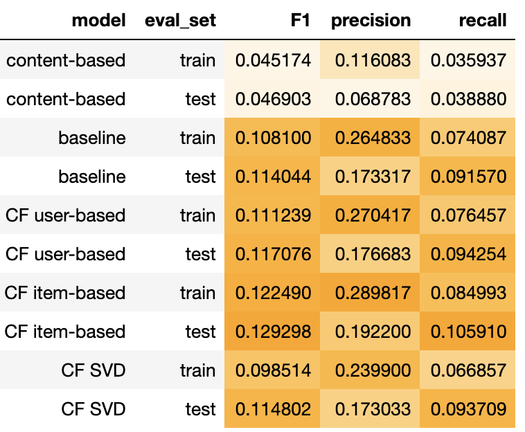

# Personalised recommendations to increase AOV of Instacart loyalists

In the era of online marketplaces, consumers are flooded by far too many choices that are impossible for them to explore fully. Personalized recommendations thus play an important role in helping consumers reduce information overload and discover new and interesting products. On the other end, companies benefit from recommender systems through increased conversions, average order values, and improved customer experience.

## Problem Statement

In grocery shopping, many customers make multiple purchases of the same or very similar products more frequently than buying entirely new items. They do not tend to search as extensively for new and interesting options as they do with leisure items such as books and TV shows, which means that there are opportunities for Instacart to increase their customers' discovery of new products, and should the product recommendations bring about successful conversions, this will allow Instacart to achieve revenue growth.

As more people shift towards online shopping amid coronavirus lockdowns, it has become more paramount than ever for Instacart to improve their users' shopping experience in order to compete with the large-scale grocery retailers that have been ramping up their online channels. This is especially critical in allowing them to retain the continued loyalty of their top customer base.

As the famous 80/20 principle states, the top 20% of customers contribute 80% of a business' profits. In this project, I will focus on building a recommender system using the purchase histories of Instacart's top customers to create tailored product recommendations for them.

## About Instacart

Instacart can be thought of as the "grocery equivalent" of food delivery services like Deliveroo and Foodpanda. It is currently one of the most popular and widely available online grocery delivery services in America.

Through the Instacart app or website, customers can pick out items from their local grocery stores, and a personal shopper will do the in-store shopping and deliver the order to the customer in less than 2 hours.

## Dataset introduction
[“The Instacart Online Grocery Shopping Dataset 2017”](https://www.kaggle.com/c/instacart-market-basket-analysis) is an anonymized dataset made freely available by Instacart. It contains the following information:

- **Orders**: 3.34 million orders. Includes order ID, user ID, products bought, order in which each product was added to cart, time of order, day of order, and whether product was a reorder by that user.
- **Users**: About 206,000. Only user IDs were provided.
- **Products**: Almost 50,000 products. along with aisle and department information.

## Project workflow

View notebooks on NBviewer:

- [Part 1: Data merging](https://nbviewer.jupyter.org/github/zixinlee/GA-data-science/blob/master/Capstone-Instacart/code/1_data_merging.ipynb)
- [Part 2: EDA and data pruning](https://nbviewer.jupyter.org/github/zixinlee/GA-data-science/blob/master/Capstone-Instacart/code/2_EDA_data_pruning.ipynb)
- [Part 3: Customer clustering (RFM analysis) using K-means](https://nbviewer.jupyter.org/github/zixinlee/GA-data-science/blob/master/Capstone-Instacart/code/3_kmeans_clustering_rfm.ipynb)
- [Part 4: Data preparation for recommender systems](https://nbviewer.jupyter.org/github/zixinlee/GA-data-science/blob/master/Capstone-Instacart/code/4_data_prep_for_RecSys.ipynb)
- [Part 5: Implementation of recommender systems](https://nbviewer.jupyter.org/github/zixinlee/GA-data-science/blob/master/Capstone-Instacart/code/5_RecSys.ipynb)

First, in Part 1, I compressed the data files and merged the relational tables together before exporting them to do data exploration with.

After an exploratory analysis of the dataset in Part 2, I utilised the K-means algorithm to segment the customer base and identify Instacart's top customers in Part 3.

I then returned to the Part 2 notebook to prune the dataset to a more manageable size as there were already interim dataframes in there that would allow easier data filtering.

The dataset was pruned in the following steps:
1. Removed products that were purchased less than 150 times.
2. Removed orders with less than 4 items.
3. Include only users that have made at least 20 orders, and keep the most recent 20 orders.

Next, using the reduced dataset, I created the utility matrices required for the recommender systems in Part 4.

Finally, in Part 5, I implemented these following recommender systems:

1. Content-based filtering
2. Collaborative filtering: User-based
3. Collaborative filtering: Item-based
4. Collaborative filtering: Matrix factorization model leveraging SVD

To evaluate their performance, I randomly sub-sampled 3,000 users and generated recommendations for each of them using each of the 4 recommender systems.

Evaluation was done using these 3 metrics:

- **Precision**: what proportion of the recommended items did the user purchase?
- **Recall**: what proportion of the user's actual purchases were in the recommendations?
- **F1 score**: harmonic mean of precision and recall. The highest possible value of F1 is 1, indicating perfect precision and recall, and the lowest possible value is 0, if either the precision or the recall is zero.

Note: For the sake of evaluation, I did not filter out previously purchased items from the recommendations.

The subsequent sections detail the performance of the systems and my concluding remarks.

## Reviewing performance of the recommenders

Looking at all 3 scores, we can see that only the user-based and item-based collaborative filtering methods outperformed the baseline popularity model. And between the two, the item-based CF model fared slightly better. However, we should note the high score discrepancies between the train and test sets, which suggest that the models are heavily overfitting.

On the flip side, the content-based filtering method performed much worse than the baseline. This is likely due to the limited item features available. I had only included the aisle and department name of the product as item features, and those keywords alone are insufficient to characterise our items. An attempt was made to extract additional item features from the product name using CountVectorizer, but it did not produce any noticeable difference in the results.

As for the SVD model, its poor performance could be due to a data sparsity problem – our user-item utility matrix was 99.5% sparse, and that could have negatively affected the SVD model's ability to extract latent features from it.

## Concluding remarks

It was interesting to see how different systems generate different sets of recommendations and how well they perform on average, but I would like to emphasise that it is not prudent to make a judgement on the recommender systems' performance based on these metrics alone. The more pragmatic way to test the performance of recommender systems would be to actually track the actual click-through and conversion rates of the recommendations, which is not possible in this instance.

Furthermore, the way I had generated and re-ranked potential recommendations for each model, e.g. selecting 20 nearest neighbours for user-based collaborative filtering, was highly arbitrary. Selecting different values for the k-nearest neighbours and number of similar items to form my potential recommendation set could greatly alter the performance of the models. Similarly, re-ranking the recommendations (for user-based and item-based CF) in a different way, e.g. by the number of purchases from similar customers, instead of using total sales volume, could change the final recommendation set significantly.

Another factor that could impact the performance of the non-MF models is the way we normalise the utility matrix. I had de-meaned the matrix by doing a row-wise subtraction of the average, but another way to do it is to use the TfidfVectorizer from scikit-learn to normalize the matrix values. We could also represent the matrix as a binary matrix, i.e. 1 if the user has purchased the item before, else 0.

Moving beyond the algorithms tested, I would also like to highlight these additional qualitative points of consideration since product recommendation strategies require a multi-pronged approach.

### Recommendations need to be made more contextual

The personalised recommendations generated from my implemented recommender systems only form the general "Recommended For You" layer of recommendations. In reality, e-commerce retailers employ different product recommendation strategies for different pages on the site, such as:

- **Homepage**: "Recently viewed" / "Buy it again" / "Recommended For You"

- **Category pages**: "Most Popular in Category" / "Recommended For You" (category-specific)

- **Product detail pages (PDPs)**: "Similar Products" / "Often Bought Together"

- **Cart pages**: "Often Bought Together" (showcasing products that are slightly cheaper than those in a user’s cart can lead to quick purchase decisions)

- **Search results page**: Results returned from search queries can also be considered a form of recommendation. These items are ranked by probability of purchase.

### More granularity needed to truly personalise the recommendations

- We wouldn't want to recommend non-vegan items to a vegan customer.

- Consumers who have high average order values can be recommended more highly profitable items in order to maximise revenue.

- We don't want to recommend items from the user's most recent basket, especially for items that are not weekly purchase items.

### Consider diversity of recommendations as well

- Because our tested recommendation systems are biased towards recommending items that have relatively high sales volume, they are unable to surface truly novel items that have not been discovered by many other people.

- We can improve the diversity of recommendations by recommending these long-tail items to increase the novelty factor for the user.

- Include recommendations from stores customers may have never shopped from previously. This is appropriate for customers who have a high unique-items-to-total-items ratio.
