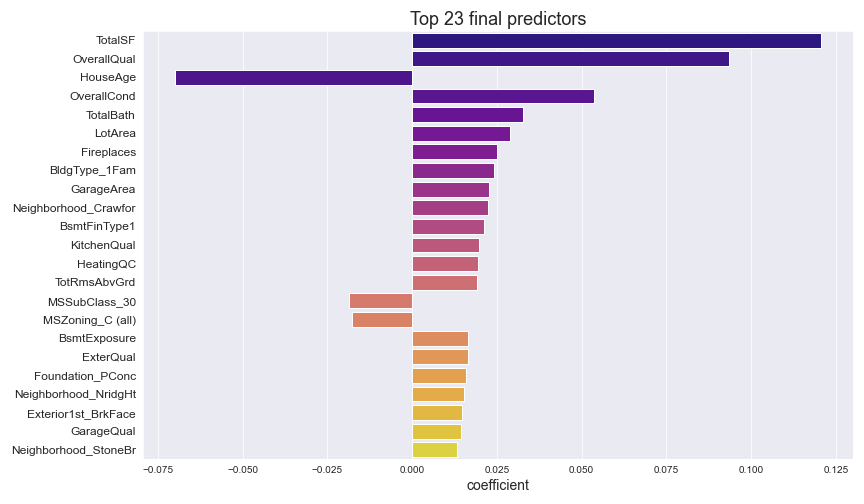

# Project 2: Predicting house prices in Ames, Iowa, USA

## Introduction

In this project, my goal is to develop a regression model that will make accurate predictions of the sale prices of houses in the city of Ames in Iowa, USA.

The benefits of obtaining accurate house price predictions are manifold. For instance, homeowners can have a better gauge of a fair selling price they should list for their house. This way, they will not underprice their house and lose out on potential profit. Similarly, homebuyers can know what is a fair price to be paying for a particular house and will not unknowingly purchase overvalued properties.

Through a regression model, we will also be able to identify some features that increase or decrease the value of a house. With this knowledge, property developers could better understand which features to include or exclude in future developments. They would already have domain expertise in this area, and a regression model could help to reinforce what they already know and perhaps reveal things that are less apparent.

The project involves analysing the **Ames Housing Dataset**, which is composed of over 2,900 records of properties transacted in Ames between 2006-2010. The 2,900 records are split between two separate _train_ (2,051 records) and _test_ (879 records) datasets.

Each instance comprises 78 features of four different data types: Nominal, Categorical, Continuous, and Discrete.

The target variable in our analysis is the `SalePrice` of the house.

To simplify my model, my aim will be to identify only the top 20-30 factors that influence the value of a house.

Due to the scope of the analysis, my workings are split into two notebooks:

1. Data cleaning, preprocessing, and feature engineering
2. Modelling, feature selection, and prediction

## Part 1: Data cleaning, preprocessing, and feature engineering

### Data cleaning
These were the steps taken to clean the data:

- Drop columns with >80% missing values (four columns were dropped)
- Observations with missing values were not dropped; instead I imputed values for them in a sensible manner
- Remove features with low variance in their values as they would not help much in explaining the variations in `SalePrice`
- Check the correlation between numerical variables and remove the highly correlated features
- Remove features without meaningful information, e.g. `MiscVal` (unclear what information it contains) and `LowQualFinSF` (contains many 0 values and shows no relationship with `SalePrice`)

### Data preprocessing

- Integer encoding for ordinal variables, which involves mapping each unique label to an integer value
- Changing numerical type values to string category (if the feature is nominal)
- One-hot encoding of nominal variables
- Log transformation of the target variable `SalePrice` to reduce its scale of values. This makes the model less sensitive to outliers because a log transformation de-emphasises them (outliers are brought close in). This would in turn improve prediction accuracy.

### Feature Engineering

To reduce the number of features, I linearly combined some of the related features and dropped the constituent columns.

These are the two new variables created from the existing variables:
  1. `TotalSF`

  Total square footage of the house, including the basement. `TotalSF` replaced `GrLivArea`, `1stFlrSF`, `2ndFlrSF`, `TotalBsmtSF`, `BsmtFinSF1`, `BsmtFinSF2` and `BsmtUnfSF`

  2. `TotalBath`

  Total number of full and half bathrooms in the house

  3. `HouseAge`

  Replaced `YearBuilt` and `YrSold` with `HouseAge` by deducting the year that the house was constructed (`YearBuilt`) from the year it was sold (`YrSold`). `MoSold` was also subsequently dropped.

There were also several columns pertaining the the square footage of certain areas of the house, such as the pool or the wood deck. There were many null values in these columns so I converted them into binary columns to indicate the presence or absence of certain features instead.

These are the new variables created:
1. `HasPorch`: Grouped together `OpenPorchSF`, `EnclosedPorch`, `3SsnPorch`, `ScreenPorch`

2. `HasWoodDeck`: Converted from `WoodDeckSF`

3. `HasPool` was created as well but it was dropped immediately as it had more than 90% of values in a single value

At the end of the process, I had 42 columns prior to one-hot encoding, and after one-hot encoding, the total number of feature columns was 169.

## Part 2: Modeling, feature selection, and prediction

After completing the data preparation, I started running the models to predict housing prices on the holdout data in the train dataset.

Now that we have completed the data preparation, we can start fitting different regression models and select the best model as well as features to predict our target variable.

Prior to modelling, we will do a scaling of our feature variables so that they have a mean of 0 and standard deviation of 1. This helps to avoid the case where one or several features dominate others in magnitude, and as a result, the model hardly picks up the contribution of the smaller scale variables, even if they are strong.

### Modeling
Four different models were tested using cross validation on training data:

- ordinary least squares linear regression
- ridge regression
- lasso regression
- elastic net regression

For my initial modelling step, I compared the performance of the 3 regularised linear models (Lasso, Ridge, and Elastic Net) with all 169 feature variables fitted onto them. OLS linear regression was not used as we still have a large number of features and that would result in severe overfitting.

Elastic Net performed the best in the initial modelling step, and to keep my process streamlined, I continued using the Elastic Net model to evaluate performance during feature selection.

### Conclusion

These are the final 23 predictors used in our model.

The Elastic Net model was able to perform consistently well (the mean CV R2 score remained around 0.89) even after cutting the number of features down.

The final model used to make predictions for the actual test dataset produced a CV mean R2 of 0.90169, which means the model was able to explain 90.2% of the variations in `SalePrice`. The Kaggle score (RMSE) was 23,267.

A disadvantage of using an Elastic Net model is that it would require more computational power since we also need to cross-validate the relative weight of L1 vs. L2 penalty, 𝛼. The scope of our analysis still allows us to run the Elastic Net model pretty swiftly, but for larger datasets with more instances and/or features, we might need to experiment with Lasso and/or Ridge instead.

**Interpretation of final selected features**

The coefficients from our Elastic Net regression tell us the relative importance of each feature on `SalePrice`, but they are not directly interpretable and do not tell us the effect of one unit change in the feature variable on `SalePrice`. Homeowners can focus on these features when trying to improve the value of their homes.

1. As expected, a higher/better value in these features will almost always increase house value: `TotalSF`, `OverallQual`, `OverallCond`, `LotArea`, `TotalBath`, `Fireplaces`, `GarageArea`, `KitchenQual`, `HeatingQC`, `ExterQual`, `TotRmsAbvGrd`, `BsmtExposure`, `GarageQual`, `YearRemod/Add`.

2. A further investigation we can make is to check what finishings were used on houses with high `OverallQual` or `ExterQual`. Homeowners can select the finishings with the highest benefit-to-cost ratio to use on their houses when renovating, in order to bring about the greatest increment in `SalePrice`.

3. `HouseAge` is negatively correlated with `SalePrice`, which is also to be expected. Homeowners of older houses could remodel their houses before putting it up in the market for sale if they want to increase its `SalePrice`.

4. According to this model, `BldgType_1Fam` aka single-family detached houses will fetch higher prices than other types. A cross-reference to the boxplot of `SalePrice` against `BldgType` from our initial EDA showed us that there is a greater range of house prices associated with this building type, but that is only natural because most of the houses in our dataset are of this type (82.8%). We have to keep this in mind and avoid wrongly assuming that `BldgType_1Fam` properties will definitely have higher prices.

5. It is common knowledge that location is a big determinant of a house's price. Neighborhood-wise, houses located in `Crawfor` and `NridgHt` are expected to fetch higher prices. Investing in any undervalued houses in these neighborhoods will likely generate a positive return on investment.

6. Properties of building class type 30 (`MSSubClass_30`), which are commercial buildings, are expected to have lower prices. Without knowing more details about those commercial properties in our dataset, it would not be wise to say that commercial properties are a poor investment in Ames.

7. Houses with concrete (`PConc`) foundation are expected to have higher prices according to the model. This is not a conclusion we can make too quickly, as most houses in our dataset have a concrete foundation. This is a similar problem as described in point 5.

### Limitations

- **Hyperparameter tuning**: A predefined range of values was passed in to tune the hyperparameters for our regularisation models. There is a possibility that there are values outside of the predefined range that could have produced better results.

- **Other external factors not taken into account**: The value of a house is not purely determined by the features we have analysed. There are many other factors which could affect house demand and supply, such as the current economic climate, housing policies, demographic changes, proximity of the house to amenities like malls and schools, and so on. Predictions from our model are limited in its accuracy as it does not consider these factors.

- **Limited timeframe**: Our data comprised only transactions between 2006–2010. This is a pretty short timeframe, which makes it hard to capture actual general trends in sale prices of houses in Ames. The housing market within the 2006-2010 timeframe could be very different from how it is in present time.

- **Missing values**: There were numerous missing values for which we did a convenient imputation for. This has definitely introduced a certain level of inaccuracy into our analysis.

- **Limited generalisability to houses outside of Ames, Iowa**: The predictive model we've built only applies to the houses in Ames and will not be accurate when applied to houses in other cities or countries. To make it more applicable across the board, we could perhaps remove features specific to houses in the U.S. or Ames, such as replacing Ames' neighborhood with a metric describing a property's distance from the city centre, or whether a property is near a buzzing commercial hub, etc.

------
