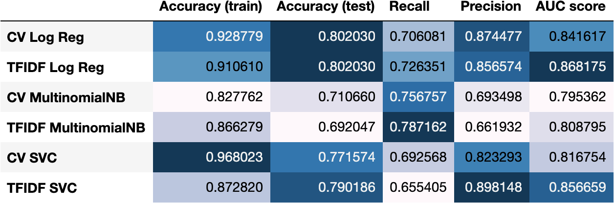
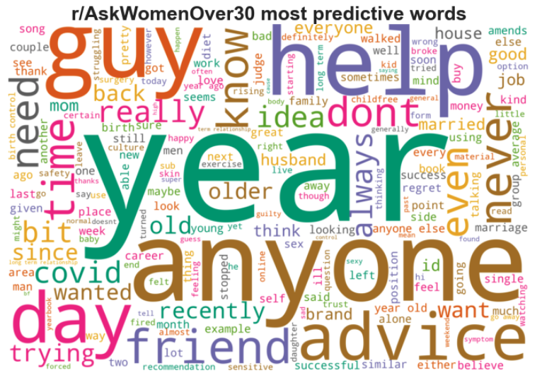
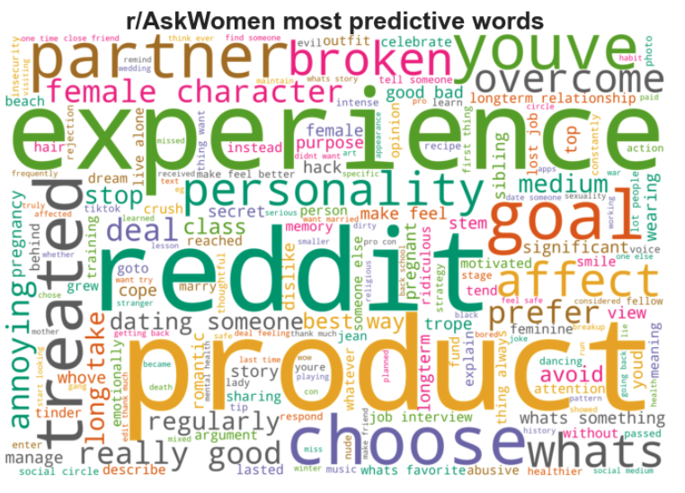

# Project 3: Classifying subreddits

For the uninitiated, Reddit is an American mega-forum where people can share any kind of news and content and have discussion with other Redditors. Reddit has more than 300 million users and is divided into more than 100,000 sub-forums known as subreddits. As of September 2020, Reddit ranks #17 in global internet traffic and engagement. [(Source)](https://www.alexa.com/siteinfo/reddit.com)

## Problem statement

In this project, I attempt to classify posts from two subreddits – `r/AskWomen` and `r/AskWomenOver30`. This is part of a wider project that my team is working on to automate the sorting of Reddit posts.

`r/AskWomen` and `r/AskWomenOver30` are both subreddits where women can comfortably and candidly share their responses in a non-judgmental space, but the latter is catered towards females above 30 years old.

I am interested to see whether these two subreddits are distinct enough to be distinguished by a classifier, and explore whether the classifier can extract meaningful differences in the topics discussed in the two subreddits.

## Data collection

Using Reddit's API, I collected close to 1,000 posts from each subreddit. The posts were cleaned and preprocessed as outlined in the steps below to transform the text into a usable format for our classifier models.

* Remove posts by moderators
* Combine post title column and post content column into a single full-text column
* Create target variable column `is_askwomenover30`
* Make text all lowercase
* Remove punctuation
* Remove all non-alphabetical text
* Remove stopwords
* Lemmatize words

## Modelling

The following 3 models were tested together with both the CountVectorizer and TfidfVectorizer for feature extraction:

 1. Logistic regression
 2. Multinomial Naive Bayes
 3. Support vector classifier

Due to several hyperparameters that require tuning, all 3 classifiers were optimised using GridSearchCV to find the best hyperparameter combination.

The below table summarises the performance of each model:

Generally speaking, the Logistic Regression models performed the best, followed by Support Vector Classifiers, then Multinomial Naive Bayes.

- Logistic Regression obtained the highest average accuracy and AUC scores
- Multinomial Naive Bayes achieved the highest recall scores
- Support Vector Classifier achieved the highest precision scores

In my case, since the classes in my dataset are balanced, the metrics that I  prioritise are accuracy and AUC score. Accuracy quantifies my model's ability to make correct predictions, whereas AUC quantifies the classifier's ability to separate the two classes, regardless of the threshold value.

Given that logistic regression had the best accuracy and AUC scores, it was selected as our final model. For the vectorizers, using the TFIDF Vectorizer gives us a higher AUC score than the Count Vectorizer. Thus, the final model will be **TfidfVectorizer + Logistic Regression**.

## Results from the best model

### Top predictors

These word clouds show the top predictive words for the respective subreddits.

### Misclassified posts

20% of the posts in our validation set (119 out of 591) were misclassified.

Looking at the documents that were misclassified, it seems that many of them were very short in length (less than 10 words) and and had generic content, i.e. they do not contain keywords that would allow the model to easily identify which subreddit they came from.

## Conclusion

Using a TfidfVectorizer + Logistic Regression classifier trained on title and post content allowed us to classify unlabelled posts into the correct subreddit with an 80% accuracy rate. This shows that there is a distinguishable difference in most of the posts from the two subreddits, although it is hard to infer from our top predictor words that they are differentiated by age-group.

It is hard to make the generalisation that there is a clear separation in the topics discussed by women above 30, given that different people move through life at different paces and not everyone within the same age group will share the same life stage and life events. Hence, what is relevant to r/AskWomenOver30 could also be very relevant to r/AskWomen.

### Limitations and future developments

- Despite the high accuracy of the model, the most predictive words for each subreddit do not give me meaningful insight about the topics that are discussed. If I want to gain more clarity about the topics, I could try doing topic modelling instead.

- For this analysis, we only have close to 1,000 documents to train the model with. To further improve our model's accuracy, I would need more content to expand the vocabulary associated with each subreddit. Next time, I could try using the PushShift API to collect more posts to train the model with.

- The analysis was only done on the title and content of a post. What could add value to the model would be to analyse the comments as well since the two subreddits analysed are heavily discussion-based. The responses provided by the members of the respective subreddits would likely give us more insight about them as opposed to the title and post content.

- The misclassification of posts could have been partially contributed by the short length of certain posts. With fewer terms in a document, it might be harder for the model to accurately predict the correct class based on only those few words. One possible exploration to make is to filter out documents that have less than _n_ words, e.g. 10 words.

- This time round, I did lemmatization of the words, but I could also try stemming the words to see how the results would be affected.

- There is imbalance in the member count and hence activity within each subreddit. As of 8 September 2020, `AskWomenOver30` only has 79.6k members whereas `AskWomen` has 1.3m members. There could be many women over 30 who are unaware of the existence of the `AskWomenOver30` subreddit and make their posts only on the `AskWomen` subreddit, and as a result there could be many posts on the `AskWomen` subreddit that would be more appropriate for the `AskWomenOver30` subreddit instead.

- The bag-of-words approach used does not allow for named entity recognition. Some word sequences may constitute proper names, such as the names of corporations, but these named entities will be transformed into meaningless words during the vectorization process. Next time, I could try using spaCy to do named entity recognition before vectorization.

### Final remarks

In spite of the limitations, the model performed very decently in separating the posts from the two subreddits. With more training and further fine-tuning, I believe the model can be deployed to do automatic post-sorting between r/AskWomen and r/AskWomenOver30.

### Code and resources used

Python version: 3.7
Packages: pandas, numpy, matplotlib, seaborn, sklearn, NLTK
